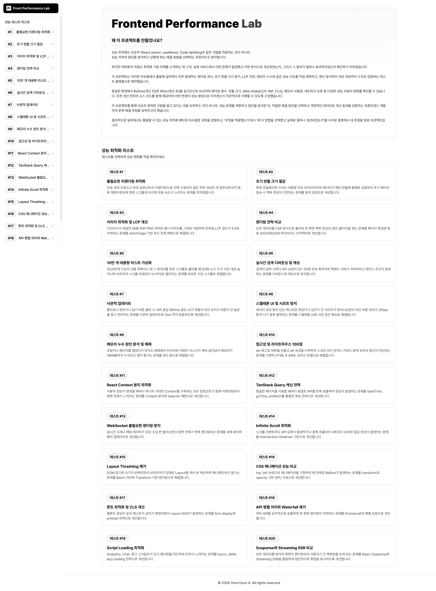

# Frontend Performance Lab

> **React랑 Next.js로 개발할 때 앱이 느려지는 원인을 찾아내고, 여러 최적화 방법을 써보면서 실제로 얼마나 빨라지는지 직접 테스트해본 프로젝트입니다.**



---

## 1. 프로젝트 개요

- **프로젝트명**: Frontend Performance Lab
- **개발자**: 윤현아
- **프로젝트 형태**: 개인 포트폴리오 프로젝트
- **주요 내용**: 개발할 때 자주 겪는 20가지 성능 문제들을 일부러 만들어보고, 왜 느려지는지 원인을 찾아서 고친 다음 고치기 전후 수치를 직접 비교해본 테스트 프로젝트입니다.

---

## 2. 프로젝트를 만든 이유

### "그냥 최적화 문법만 외우는 게 아니라, 진짜 왜 느린지 알고 고치는 게 중요하다고 생각했습니다."

성능 최적화라고 하면 보통 `React.memo`나 `Code Splitting` 같은 기술부터 떠올리기 쉽습니다. 하지만 서비스마다 느려지는 이유는 제각각이라, 무작정 남들이 쓴다고 따라서 적용해봤자 아무 효과가 없을 때가 많았습니다.

그런데 인터넷이나 강의를 찾아보면 그냥 문법 사용법만 알려줄 뿐, "어떤 상황에서 고장 났고, 고치고 나서 실제 숫자가 얼마나 나아졌는지" 제대로 보여주는 곳이 별로 없어서 아쉬웠습니다.

그래서 답답한 마음에 **직접 코드로 쳐보면서 확인하려고 이 프로젝트를 만들었습니다.**
1. 화면 렉, 용량 초과, 이미지 로딩 지연, 메모리 누수 같이 자주 만나는 20가지 성능 문제들을 일부러 발생시켰습니다.
2. 버튼 하나로 **개선 전**과 **개선 후**를 바로 실행해보고 눈으로 비교할 수 있게 화면을 구성했습니다.
3. 렌더링 횟수, 파일 크기, 로딩 속도, 메모리 사용량 같은 수치들을 그대로 화면에 띄워서 진짜 효과가 있는지 테스트했습니다.

---

## 3. 구조와 아키텍처

### FSD 구조를 쓴 이유
테스트 케이스가 20개나 되다 보니 코드가 섞이고 복잡해지는 문제가 있었습니다. 그래서 폴더와 코드가 서로 꼬이지 않게 FSD 구조를 도입했습니다.

```
src/
├── app/               # 페이지 라우팅과 전체 레이아웃
├── widgets/           # 대시보드랑 상단 리포트 같은 공통 화면 블록
├── features/          # 20가지 성능 테스트 구현 코드들
├── entities/          # 테스트용 데이터와 리포트 내용 모음
└── shared/            # 공통 버튼, 카드 컴포넌트
```

- **코드끼리 안 꼬이게 관리**: 새로운 성능 테스트를 계속 추가해도 기존에 만든 다른 테스트 코드에 영향이 가지 않도록 딱 분리했습니다.
- **데이터랑 화면 분리**: 20개 테스트의 설명이나 소스코드는 한곳에서 모아 관리하고, 화면에서는 가져와서 보여주기만 하도록 구성했습니다.

### Dynamic Import를 쓴 이유
20개 테스트 화면에 필요한 코드들을 처음부터 한꺼번에 전부 불러오면 메인 화면부터 로딩 렉이 걸립니다.
그래서 유저가 해당 테스트를 클릭해서 들어갈 때만 필요한 코드를 가져오도록 (`next/dynamic` 이용) 쪼개두었습니다.

---

## 4. 쓴 기술과 이유

| 기술 | 이유 |
| :--- | :--- |
| **Next.js 14** | SSG, ISR, SSR 같은 다양한 서버 렌더링 방식을 직접 써보고 비교하기 좋아서 선택했습니다. |
| **React 18** | 리액트 최신 기능들이나 렌더링 동작 방식을 제대로 테스트해보려고 썼습니다. |
| **TanStack Query v5** | API 데이터 캐싱이랑 화면 이동할 때 반복 호출되는 걸 막는 데 제일 편해서 썼습니다. |
| **Zustand** | 불필요하게 전체 화면이 다시 그려지는 걸 막고 필요한 값만 가져와 쓰기 좋아서 골랐습니다. |
| **TanStack Virtual** | 리스트 아이템이 10만 개 넘어가도 화면에 보이는 것만 그려서 안 튕기게 하려고 썼습니다. |
| **Tailwind CSS** | 별도 CSS 파일 안 쪽에고 빠르게 반응형 화면이랑 깔끔한 디자인을 만들 수 있어서 썼습니다. |
| **Biome** | 빠른 코드 검사로 오타나 타입 에러를 바로 잡아주어 썼습니다. |

---

## 5. 20가지 성능 테스트 목록

| 번호 | 테스트 이름 | 어떻게 고쳤나 | 결과 수치 |
| :---: | :--- | :--- | :---: |
| **#01** | **불필요한 리렌더링 최적화** | Zustand Selector랑 React.memo 사용 | 142회 ➔ 12회 (91.5% 감소) |
| **#02** | **초기 번들 크기 줄이기** | dynamic import로 비동기 코드 쪼개기 | 2.8MB ➔ 480KB (82.8% 감소) |
| **#03** | **이미지 로딩속도(LCP) 고치기** | next/image로 WebP 변환하고 우선로딩 적용 | 5.4초 ➔ 1.2초 (77.7% 단축) |
| **#04** | **렌더링 방식 비교** | CSR 방식에서 ISR 방식으로 교체 | 1.8초 ➔ 45ms (97% 속도 향상) |
| **#05** | **10만 개 리스트 가상화** | TanStack Virtual로 보이는 15개만 렌더링 | DOM 10만개 ➔ 15개 (60 FPS 유지) |
| **#06** | **실시간 검색 요청 줄이기** | 300ms 디바운스랑 Query 캐싱 묶기 | API 요청 28회 ➔ 2회 (92.8% 절감) |
| **#07** | **버튼 반응속도 0ms 만들기** | TanStack Query 낙관적 업데이트 적용 | UI 대기 850ms ➔ 0ms (즉시 반응) |
| **#08** | **화면 덜컥거림(CLS) 방지** | aspect-ratio로 자리 미리 빼두기 | CLS 지표 0.28 ➔ 0.00 (튐 없음) |
| **#09** | **메모리 누수 잡기** | useEffect 리턴 함수에 타이머 정리 쓰기 | 메모리 185MB ➔ 14MB (92% 해제) |
| **#10** | **접근성 100점 만들기** | div 버튼을 표준 button과 ARIA로 교체 | 점수 58점 ➔ 100점 만점 |
| **#11** | **React Context 나누기** | 거대한 Context를 전용 Context로 쪼개기 | 렌더링 180개 ➔ 2개로 감소 |
| **#12** | **API 캐싱으로 로딩 없애기** | staleTime, gcTime 설정하고 미리 불러오기 | API 호출 15회 ➔ 1회로 감소 |
| **#13** | **웹소켓 렌더링 렉 방지** | 수신 데이터 useRef 버퍼에 모아서 500ms마다 업데이트 | 초당 45회 ➔ 2회로 억제 |
| **#14** | **무한 스크롤 중복요청 막기** | Intersection Observer랑 fetching 락 걸기 | 중복 호출 18회 ➔ 0회 완벽 차단 |
| **#15** | **Layout Thrashing 제거** | DOM 읽기/쓰기 연산 묶어서 배치 처리 | 강제 Reflow 50회 ➔ 0회 |
| **#16** | **CSS 애니메이션 렉 잡기** | top/left 대신 transform이랑 GPU 가속 쓰기 | CPU 렉 ➔ GPU 전담 처리 |
| **#17** | **폰트 로딩 덜컥거림 잡기** | WOFF2 경량화, 미리로드, font-display: swap | FOUT CLS 0.19 ➔ 0.00 (밀림 없음) |
| **#18** | **API 순차 호출(Waterfall) 제거**| 하나씩 기다리던 걸 Promise.all로 한꺼번에 발사 | 대기 1,850ms ➔ 420ms (77.2% 단축) |
| **#19** | **외부 스크립트 로딩 고치기** | next/script의 lazyOnload 옵션으로 미루기 | 화면 블로킹 3.2초 ➔ 0.8초 단축 |
| **#20** | **Streaming SSR 적용해보기** | React Suspense 써서 빠르게 상단부터 띄우기 | 첫 화면 대기 2.4초 ➔ 120ms 단축 |

---

## 6. 디자인 요소

- **기초 테마**: 깔끔하고 보기 편하게 Vercel 스타일의 미니멀 단색 디자인으로 통일했습니다.
- **소스코드 에디터 느낌**: 코드 비교하는 부분은 거창한 라이브러리 없이 실제 IDE 에디터처럼 알록달록하게 컬러가 보이도록 구문 하이라이터를 직접 만들었습니다.
- **모바일/태블릿 지원**: 휴대폰이나 태블릿으로 봐도 글자나 버튼이 깨지지 않게 사이드바와 레이아웃을 반응형으로 맞췄습니다.

---

## 7. 실행해보기

### 개발 서버 켜기
```bash
# 1. 저장소 가져오기
git clone https://github.com/hyonna/frontend-performance-lab.git
cd frontend-performance-lab

# 2. 패키지 설치
pnpm install

# 3. 개발 서버 실행
pnpm dev
```
`http://localhost:3000` 으로 접속하면 바로 테스트해볼 수 있습니다.

### 코드 검사 및 빌드
```bash
# 린트 코드 검사
pnpm check

# 프로덕션 빌드 테스트
pnpm build
```

---

## 8. 개인 회고

그냥 블로그에 나오는 최적화 팁들을 머리로만 외우는 게 아니라, **"실제로 어디가 어떻게 고장 나는지, 코드를 이렇게 바꾸면 진짜 숫자가 바뀌는지"** 하나하나 쳐보면서 렌더링 과정이나 브라우저 동작 방식을 확실하게 이해할 수 있었습니다.

앞으로 실무에서 개발할 때도 그냥 남들 하는 대로 습관적으로 코딩하는 게 아니라, 왜 이렇게 짜야 하는지 이유를 생각하면서 만드는 개발자가 되고 싶습니다.

---
© 2026 Yoon Hyun A. All rights reserved.
